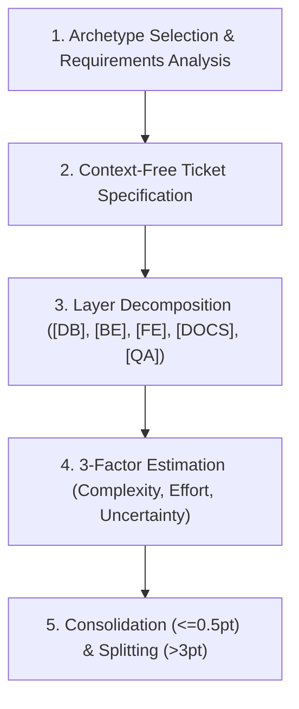

# Task & Engineering Planning Skill

Standard Operating Procedure for decomposing business and technical requirements into fully self-contained, actionable tickets across 5 distinct archetypes with calibrated 3-factor story point estimation.

## When to use

- Decomposing high-level feature requests, PRDs, or architecture specs into engineering tickets.
- Authoring user stories, technical refactors, bug reports, research spikes, or security fixes.
- Establishing testable Given-When-Then (Gherkin) or measurable checklist Acceptance Criteria.
- Estimating effort and risk using the calibrated 3-Factor Matrix (Complexity, Effort, Uncertainty).
- Defining layered task boundaries across `[DB]`, `[BE]`, `[FE]`, `[DOCS]`, and `[QA]`.

## Planning Workflow



### Phase 1: Requirements Analysis & Archetype Selection
1. Identify the work category and choose the appropriate archetype:
   - **Feature / User Story**: Business capability with end-user value.
   - **Technical Task / Refactor**: Architecture, tech debt, performance, migration.
   - **Bug Report / Defect**: Unintended behavior, regression, error state.
   - **Research Spike**: Timeboxed exploration to retire architectural uncertainty.
   - **Security Fix**: Vulnerability remediation with zero-trust verification.
2. Read `@references/ticket-format.md` for template schemas and archetype contracts.

### Phase 2: Context-Free Ticket Authoring
1. Enforce the **Context-Free Execution Principle**: ensure zero tacit memory dependency so any engineer or AI agent can execute independently.
2. Explicitly specify:
   - Absolute or repository-relative file paths.
   - Request/response payload schemas and data models.
   - Error code dictionaries and edge cases.
   - Deterministic Acceptance Criteria.

### Phase 3: Layer Decomposition & Documentation
1. Decompose the ticket across functional engineering layers:
   - `[DB]` Database migrations, schemas, indexes, constraints.
   - `[BE]` API routes, controllers, domain services, validations.
   - `[FE]` UI components, state stores, forms, API clients.
   - `[DOCS]` OpenAPI specifications, ADRs, developer guides, runbooks.
   - `[QA]` Automated unit, integration, and E2E regression tests.
2. Read `@references/task-decomposition.md` for decomposition guidelines.

### Phase 4: Sizing & Slicing Calibration
1. Calculate estimates using the 3-Factor Matrix: $\text{Estimate} = f(\text{Complexity}, \text{Effort}, \text{Uncertainty})$.
2. Apply boundary thresholds:
   - **Consolidate** tasks $\le 0.5\text{ pt}$ into parent subtasks.
   - **Split** tasks $> 3\text{ pt}$ into vertical slices or research spikes.

## Core Output Contract

```markdown
# [ARCHETYPE]: [Descriptive Title]

## Context & Objective
[Self-contained background, problem statement, or User Story]

## Technical Specification & File Targets
- **Target Files**: `path/to/target/file.ts`, `migrations/xxx.sql`
- **Contracts / Schemas**: Request/Response JSON, DB schema

## Acceptance Criteria
- [ ] **AC 1**: Given [state], when [action], then [outcome].
- [ ] **AC 2**: Given [invalid input], when [action], then [specific error code/response].

## Subtask Decomposition
- [ ] **[DB]**: Migration and model updates *(Est: 0.5 pt)*
- [ ] **[BE]**: Domain service and API endpoint handler *(Est: 1.0 pt)*
- [ ] **[FE]**: UI components and client integration *(Est: 1.0 pt)*
- [ ] **[DOCS]**: API OpenAPI schema and documentation *(Est: 0.5 pt)*
- [ ] **[QA]**: Unit, integration, and regression test suites *(Est: 0.5 pt)*

## Edge Cases & Risks
- [Failure modes, backward compatibility, performance boundaries]
```
