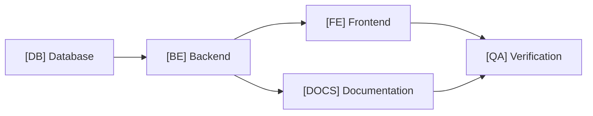

# Technical Task Decomposition & Estimation Guide

Guidelines for breaking down user stories and technical requirements into decoupled, parallelizable subtasks with calibrated story point estimates.

---

## 1. 3-Factor Estimation Matrix

Story point estimation is a deterministic function of three core dimensions:

$$\text{Estimate} = f(\text{Complexity}, \text{Effort}, \text{Uncertainty})$$

### Factor Definitions

| Factor | Description | Rating Scale |
|---|---|---|
| **Complexity (C)** | Algorithmic difficulty, architectural impact, state management, and systemic coupling. | **Low**: Standard CRUD, established patterns. **Medium**: Multi-entity logic, state machines, async handling. **High**: Distributed protocols, novel algorithms, core engine changes. |
| **Effort (E)** | Total volume of work, number of files/components touched, boilerplate, and test coverage surface. | **Small**: 1–2 files, localized edits. **Medium**: Multi-file vertical slice, multiple unit tests. **Large**: Cross-package refactoring, broad surface area. |
| **Uncertainty (U)** | Unknowns in domain logic, third-party API reliability, legacy dependencies, or missing specifications. | **Low**: Proven tech, clear docs, existing patterns. **Medium**: Unfamiliar third-party API, partial documentation. **High**: Undocumented legacy system, novel architecture, unvalidated hypotheses. |

### Calibrated Scoring Matrix

| Complexity (C) | Effort (E) | Uncertainty (U) | Story Points | Practical Duration | Action / Guideline |
|---|---|---|---|---|---|
| Low | Small | Low | **0.5 pt** | < 2 hours | Micro-task. Candidate for consolidation. |
| Low | Medium | Low | **1.0 pt** | Half-day | Straightforward single-layer change or routine endpoint. |
| Medium | Small | Low | **1.0 pt** | Half-day | Focused change with non-trivial internal logic. |
| Medium | Medium | Low | **2.0 pt** | 1 day | Standard vertical slice across DB, Backend, and Frontend. |
| Low | Large | Low | **2.0 pt** | 1 day | High boilerplate / repetitive changes with low risk. |
| Medium | Medium | Medium | **3.0 pt** | 2–3 days | Multi-system integration or complex state orchestration. |
| High | Medium | Low | **3.0 pt** | 2–3 days | Deep algorithmic or architectural change with known scope. |
| Any | Large | High | **5.0+ pt** | > 1 week | **VIOLATION**: Exceeds threshold. Must be split or spiked. |

---

## 2. Sizing Thresholds: Consolidation & Splitting

To prevent administrative bloat and delivery bottlenecks, enforce strict point boundaries:

### Consolidation Threshold ($\le 0.5\text{ pt}$)
- Tasks estimated at **$\le 0.5\text{ pt}$** create disproportionate ticket overhead.
- **Rule**: Merge micro-tasks into the primary implementation subtask.
  - *Example*: Combine a minor migration seeder edit with the `[DB]` schema migration.
  - *Example*: Combine copy changes or minor style tweaks with the `[FE]` component task.

### Splitting Threshold ($> 3.0\text{ pt}$)
- Tasks estimated at **$> 3.0\text{ pt}$** carry elevated failure and delay risks and cannot fit cleanly in a standard pull request.
- **Rule**: Mandatory decomposition before work begins. Apply one of the following splitting strategies:
  1. **Vertical Slicing**: Split by user capability (e.g., Read/Query view vs. Write/Mutation workflow).
  2. **Layer Decoupling**: Split into standalone `[DB]`, `[BE]`, and `[FE]` issues linked by a shared API schema contract.
  3. **Research Spike Precursor**: If Uncertainty is **High**, extract a timeboxed Research Spike (Archetype 4) to eliminate unknowns before sizing the implementation.
  4. **Phase / Milestone Staging**: Separate Core MVP requirements from secondary edge cases, caching, or performance optimizations.

---

## 3. Subtask Layer Taxonomy & Requirements

Deconstruct all non-trivial tickets across standard functional layer tags:

### Required Layer Subtasks

1. **`[DB]` Database & Data Layer**:
   - Schema migrations, table creation, column modifications.
   - Foreign key constraints, composite indexes, cascading rules.
   - Database seeders, test fixtures, and ORM entity definitions.

2. **`[BE]` Backend & Core Domain Logic**:
   - Request DTOs, payload validation rules, parameter sanitization.
   - Domain services, business logic handlers, repository interfaces.
   - API controllers, route registration, middleware, and error handling.
   - Unit and integration tests for service and controller layers.

3. **`[FE]` Frontend UI & Client State**:
   - Component markup, styling, responsive layouts, accessibility (a11y).
   - Client state stores, actions/reducers, caching mechanisms.
   - API client SDK integration, loading states, optimistic UI updates.
   - Client-side form validation, error banners, and toast notifications.

4. **`[DOCS]` Documentation & API Specs (Mandatory Requirement)**:
   - OpenAPI / Swagger schema definitions for all new/modified endpoints.
   - Architectural Decision Records (ADRs) for non-trivial design choices.
   - Environment variable updates in `.env.example` and developer runbooks.
   - Changelog entries and user-facing release documentation.

5. **`[QA]` Quality Assurance & Automated Verification**:
   - End-to-end (E2E) browser automation flows (Playwright/Cypress).
   - Automated regression test suites and boundary condition checks.
   - Performance benchmarks, load testing scripts, and verification runs.

---

## 4. Execution Sequencing & Parallelization

1. **Contract-First Parallelization**: Finalize `[DOCS]` API contracts and schemas first to unblock parallel development between `[BE]` and `[FE]`.
2. **Database Precedence**: Apply `[DB]` migrations before executing backend domain services.
3. **Continuous Verification**: `[QA]` test scripts are authored against the contract specification in parallel with implementation.
