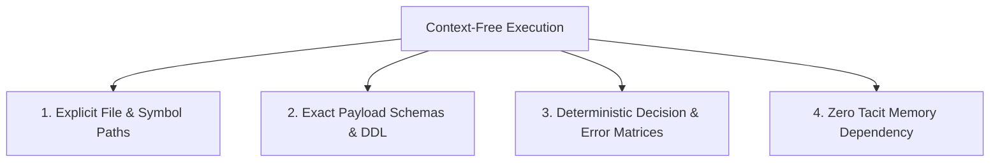

# Ticket Formatting & Archetypes Guide

Standard Operating Procedure for authoring unambiguous, context-free engineering tickets, acceptance criteria, and technical task specifications.

---

## 1. The Context-Free Execution Principle

Every ticket must be authoritatively self-contained. Any software engineer or autonomous AI agent must be able to execute the ticket to completion without prior conversational history, tacit memory, or external unlinked context.

### The 4 Pillars of Context-Free Tickets



1. **Explicit File & Symbol Paths**:
   - Provide exact repository-relative file paths (e.g., `src/services/billing.service.ts`, `prisma/schema.prisma`).
   - Name specific classes, methods, endpoints, and database tables involved.
2. **Exact Payload Schemas & DDL**:
   - Include complete TypeScript interfaces, JSON request/response bodies, or SQL DDL statements.
   - Do not use placeholders like `/* other fields */` for essential schemas.
3. **Deterministic Decision & Error Matrices**:
   - Explicitly list HTTP status codes, error codes, and failure responses (e.g., `422 Unprocessable Entity` with `{ "code": "INVALID_EXPIRATION" }`).
   - Define exact business rules for boundary conditions and edge cases.
4. **Zero Tacit Memory Dependency**:
   - Eliminate vague references (e.g., *"as discussed in Slack"*, *"improve performance"*, *"fix UI layout"*).
   - State all assumptions, environment variables, and pre-conditions directly within the ticket.

---

## 2. The 5 Multi-Type Ticket Archetypes

Select the archetype matching the nature of the work:

---

### Archetype 1: Feature / User Story
**Purpose**: Delivering net-new capability or business value to end-users or consumers.

```markdown
# [FEAT]: [Feature Title]

## Context & User Story
**As a** [user persona / role],
**I want to** [action / capability],
**So that** [business value / desired outcome].

## Target Files & Schemas
- **Target Files**: `src/api/v1/auth/routes.ts`, `src/views/LoginView.vue`
- **Request Schema**:
  ```json
  {
    "email": "string (valid email format, required)",
    "password": "string (min 8 chars, 1 number, 1 special char, required)"
  }
  ```
- **Response Schema (`201 Created`)**:
  ```json
  {
    "userId": "usr_948172",
    "token": "jwt_token_string",
    "expiresAt": "2026-09-01T00:00:00Z"
  }
  ```

## Acceptance Criteria (Given-When-Then / Gherkin)
- [ ] **AC 1 (Happy Path)**:
  - **Given** an unauthenticated visitor on the registration page,
  - **When** they submit valid credentials adhering to schema rules,
  - **Then** return HTTP 201 with JWT token and redirect to `/dashboard`.
- [ ] **AC 2 (Duplicate Email)**:
  - **Given** an existing user registered with `test@example.com`,
  - **When** a registration request is submitted with `test@example.com`,
  - **Then** return HTTP 409 Conflict with `{ "error": "EMAIL_ALREADY_REGISTERED" }`.
- [ ] **AC 3 (Validation Error)**:
  - **Given** an invalid password missing special characters,
  - **When** the registration form is submitted,
  - **Then** return HTTP 422 Unprocessable Entity and highlight the input field in red.

## Subtasks
- [ ] **[DB]**: Create migration `migrations/20260830_create_users.sql` *(Est: 0.5 pt)*
- [ ] **[BE]**: Implement `AuthService.register()` and `POST /api/v1/auth/register` *(Est: 1.0 pt)*
- [ ] **[FE]**: Build `RegisterForm.vue` with client-side schema validation *(Est: 1.0 pt)*
- [ ] **[DOCS]**: Update OpenAPI specification in `docs/openapi.yaml` *(Est: 0.5 pt)*
- [ ] **[QA]**: Author Playwright E2E registration flow test *(Est: 0.5 pt)*
```

---

### Archetype 2: Technical Task / Refactor
**Purpose**: Architecture modernization, tech debt remediation, performance tuning, or infrastructure changes.

```markdown
# [TECH]: [Refactor / Technical Task Title]

## Objective & Architectural Motivation
[Explain technical debt, bottleneck, or structural enhancement. Include metrics if applicable.]

## Target Files & Scope
- **Target Files**: `src/database/connection-pool.ts`, `config/database.ts`
- **Dependencies**: Upgrade `pg` driver from `v8.10.0` to `v8.12.0`.

## Measurable Checklist Acceptance Criteria
- [ ] Connection pool exhaustion timeout reduced from 10s to 2s under simulated load.
- [ ] Active connection count does not exceed `MAX_DB_POOL=20` under 500 req/sec benchmark.
- [ ] Backward compatibility maintained for all existing repository queries without breaking changes.
- [ ] Zero unhandled promise rejections during sudden database disconnect/reconnect simulation.

## Subtasks
- [ ] **[DB]**: Update connection configuration and connection lifetime parameters *(Est: 0.5 pt)*
- [ ] **[BE]**: Refactor `ConnectionPoolManager` to implement auto-reconnect backoff *(Est: 1.0 pt)*
- [ ] **[DOCS]**: Document database connection configuration and pooling flags in `docs/architecture/db-pooling.md` *(Est: 0.5 pt)*
- [ ] **[QA]**: Add integration load test script in `tests/load/db-pool.bench.ts` *(Est: 0.5 pt)*

## Backward Compatibility & Rollback Plan
- Fallback flag `USE_LEGACY_POOL=true` supported for immediate zero-downtime rollback.
```

---

### Archetype 3: Bug Report / Defect
**Purpose**: Resolving unintended system behavior, exceptions, regressions, or edge-case failures.

```markdown
# [BUG]: [Clear Summary of Observed Defect]

## Environment & Prerequisites
- **Environment**: Production / Staging
- **Version / Commit**: `v2.14.1` (`sha: 4a8b1c`)
- **Runtime / OS**: Node.js v20.x, Linux x86_64, Chrome 128

## Steps to Reproduce
1. Navigate to `/billing/invoices`.
2. Click on "Download PDF" for any invoice generated prior to 2026-01-01.
3. Observe browser response and application log output.

## Observed vs. Expected Behavior
- **Observed**: Server returns HTTP 500 Internal Server Error (`TypeError: Cannot read properties of undefined (reading 'currencySymbol')`).
- **Expected**: PDF downloads successfully with fallback currency symbol (`$`).

## Root-Cause Isolation
- **Suspected File**: `src/services/pdf/invoice-generator.ts:L142`
- **Root Cause**: Invoices archived before migration `0042` lack the `currencyCode` relation on the `InvoiceItem` record.

## Regression Prevention Acceptance Criteria
- [ ] **AC 1**: `InvoiceGenerator.renderPdf()` applies fallback default currency when `currencyCode` is null/undefined.
- [ ] **AC 2**: Automated regression test `tests/unit/pdf/invoice-generator.test.ts` asserts successful PDF generation against legacy fixture without `currencyCode`.
- [ ] **AC 3**: API returns HTTP 200 with `application/pdf` binary stream for pre-2026 legacy invoices.

## Subtasks
- [ ] **[BE]**: Add null-coalescing guard and unit test in `src/services/pdf/invoice-generator.ts` *(Est: 0.5 pt)*
- [ ] **[QA]**: Add legacy invoice regression test fixture in `tests/fixtures/legacy-invoice.json` *(Est: 0.5 pt)*
```

---

### Archetype 4: Research Spike
**Purpose**: Timeboxed investigation to retire architectural uncertainty, evaluate third-party tools, or validate technical feasibility before committing to implementation.

```markdown
# [SPIKE]: [Investigation / Research Topic]

## Timebox Limit
- **Maximum Timebox**: **4 Hours** / **1 Day** (Strict stop condition)

## Background & Uncertainty to Retire
[What is currently unknown? What architectural decision or performance benchmark depends on this spike?]

## Key Investigation Questions & Hypotheses
1. Can Library X handle streaming payloads $> 50\text{MB}$ without exceeding 256MB RAM?
2. Does Provider Y support mTLS authentication in Node.js runtime environments?
3. What is the expected latency penalty of schema validation on 10,000 events/sec?

## Concrete Spike Deliverables
- [ ] **Deliverable 1**: Architecture Decision Record (ADR) committed to `docs/adr/0015-stream-library-selection.md` with pros/cons matrix.
- [ ] **Deliverable 2**: Proof-of-Concept branch (`spike/stream-evaluation`) with minimal runnable prototype.
- [ ] **Deliverable 3**: Breakdown of implementation tickets and calibrated story point estimates for the chosen approach.

## Out-of-Scope Constraints
- **NO** production deployment or merge to `main`.
- **NO** exhaustive test suites or UI styling.
```

---

### Archetype 5: Security Fix
**Purpose**: Remediating security vulnerabilities, injection vectors, privilege escalations, or data leaks.

```markdown
# [SEC]: [Vulnerability Classification & Target Component]

## Threat Vector & Profile
- **Vulnerability Type**: Insecure Direct Object Reference (IDOR) / Broken Access Control
- **CWE / CVE ID**: CWE-639 / CVE-YYYY-XXXXX
- **Severity**: High (CVSS 7.5)
- **Affected Endpoint / Component**: `GET /api/v1/workspaces/:id/export`

## Exploit Scenario & Blast Radius
An authenticated user in Workspace A can request `/api/v1/workspaces/ws_workspace_b/export` by altering the route parameter, downloading sensitive tenant data without role authorization.

## Remediation Requirements
1. Enforce tenant ownership verification middleware `requireWorkspaceMember()` before export handler execution.
2. Log unauthorized access attempts to audit stream with `severity: WARN`, including actor ID and target resource ID.
3. Return HTTP 403 Forbidden with `{ "error": "FORBIDDEN" }` (do not disclose existence via 404).

## Security Verification Acceptance Criteria
- [ ] **AC 1 (Unauthorized Tenant Isolation)**:
  - **Given** an authenticated user not belonging to Workspace B,
  - **When** `GET /api/v1/workspaces/ws_workspace_b/export` is requested,
  - **Then** return HTTP 403 Forbidden and record a security audit event.
- [ ] **AC 2 (Authorized Access)**:
  - **Given** an authenticated admin of Workspace A,
  - **When** `GET /api/v1/workspaces/ws_workspace_a/export` is requested,
  - **Then** return HTTP 200 with the valid export payload.
- [ ] **AC 3 (Automated Security Regression Test)**:
  - Automated test in `tests/security/workspace-idor.test.ts` executes the attack payload and asserts 403 status.

## Subtasks
- [ ] **[BE]**: Implement tenant authorization check in `src/api/v1/workspaces/export.handler.ts` *(Est: 0.5 pt)*
- [ ] **[QA]**: Author automated IDOR security test in `tests/security/workspace-idor.test.ts` *(Est: 0.5 pt)*
```

---

## 3. Issue Quality & Readiness Checklist

Before publishing or executing any ticket, verify adherence to the following criteria:

- [ ] **Context-Free**: Can an engineer or AI agent execute this without reading chat logs or asking questions?
- [ ] **File Targets**: Are specific file paths and line ranges provided?
- [ ] **Concrete Schemas**: Are request/response JSONs, SQL schemas, or DTO types fully spelled out?
- [ ] **Deterministic ACs**: Are acceptance criteria written in Given-When-Then format or measurable checklists?
- [ ] **Layer Decoupling**: Are `[DB]`, `[BE]`, `[FE]`, `[DOCS]`, and `[QA]` subtasks explicitly delineated?
- [ ] **Calibrated Sizing**: Is the estimate between $0.5\text{ pt}$ and $3.0\text{ pt}$? (If $>3\text{ pt}$, has it been split?)
- [ ] **Documentation Mandate**: Is there a dedicated `[DOCS]` task for API changes, env vars, or ADRs?
