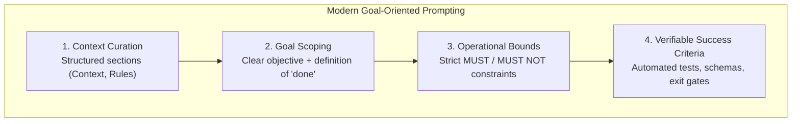

# Authoring Prompts, Personas & Workflows

Universal guidelines, architectural design patterns, and composite archetypes for authoring prompt bodies, orchestration flows, personas, and structured output contracts across all AI artifacts.

This skill governs **prompt content, cognitive architecture, language standards, and pattern composition**, regardless of the container artifact (agent, command, skill, rule, or hook) holding the prompt.

---

## 1. When to Use

- Designing or optimizing the **prompt body** for a subagent, skill, command, workflow, or rule.
- Selecting an **orchestration topology** (Supervisor-Workers, Sequential Pipeline, Router, Evaluator-Optimizer, Fan-Out/Fan-In).
- Choosing an **execution workflow** (Plan-and-Execute, SOP Checklist, State Machine, Verification Loop).
- Assembling **full-stack composite archetypes** (Specialist Implementer, Fact-Based Auditor, Autonomous Supervisor, SOP Runner).
- Selecting and fusing **composable prompt clauses** (negative constraints, cite-or-abstain, calibrated confidence, state tracker, structured markdown sections).
- Creating **visual diagrams or flows** using the **mandatory Mermaid.js standard** (no ASCII art).

---

## 2. Modern Prompt Principles (Goal Scoping vs Micromanagement)

Modern reasoning models (e.g. Claude 3.7 Sonnet / Adaptive Thinking, OpenAI o1/o3-mini, Gemini 2.0 Flash / Pro Thinking) possess native internal search tokens. Traditional procedural micromanagement (like manual "think step by step") is obsolete.

### Core Tenets
1. **Define "Done", Not the Method**: Specify what a successful output looks like and the constraints it must satisfy. Let the model's reasoning engine determine the optimal path.
2. **Eliminate Artificial Scaffolding**: Do NOT add manual "think step by step" or verbose thinking instructions to prompts when target models support native reasoning.
3. **Use Explicit Markdown Sections**: Organize prompt sections cleanly using standard Markdown headers (`## Context`, `## Rules`, `## Task`, `## Output Contract`) and fenced code blocks.
4. **Zero-Shot by Default**: Start zero-shot with crisp constraints. Add few-shot examples only for fragile syntax or non-standard DSLs.

See `references/modern-prompt-principles.md` for in-depth analysis.

---

## 3. Full-Stack Pattern Composition

In production systems, prompt patterns are assembled into a cohesive 5-layer cognitive hierarchy (Persona &rarr; Structural Frame &rarr; Boundaries &rarr; Scaffolding &rarr; Output Contracts):

| Layer | Component | Core Responsibility | Canonical Patterns |
|---|---|---|---|
| **Layer 1** | **Identity & Persona** | Operational role, privileges, and tone | `[P1.1]` Specialist, `[P1.2]` Auditor, `[P1.3]` Supervisor, `[P1.4]` Operator |
| **Layer 2** | **Structural Frame** | Section separation (`## Context`, `## Rules`) | `[P2.1]` Markdown Frame, `[P2.2]` Outline-First |
| **Layer 3** | **Boundaries & Guardrails** | Strict MUST / MUST NOT constraints | `[P3.1]` Negative Constraints, `[P3.2]` Clarify Gate, `[P3.3]` RFC 2119 |
| **Layer 4** | **Reasoning & State** | Grounding, citations, and persistence | `[P4.1]` Cite-or-Abstain, `[P4.2]` Confidence, `[P4.3]` State Tracker |
| **Layer 5** | **Output Contracts** | Machine-verifiable return schemas | `[P5.1]` Diff Contract, `[P5.2]` Rubric, `[P5.3]` Exemplars, `[P5.4]` Log |

### Ready-to-Use Production Archetypes

| Goal / Archetype | Layered Pattern Composition | Starter Template |
|---|---|---|
| **Surgical Code Implementer** | Specialist Persona + Markdown Frame + Negative Constraints + Diff/Patch Contract + Test Gate | `templates/archetype-surgical-implementer.md` |
| **Fact-Based Technical Auditor** | Auditor Persona (Read-Only) + Cite-or-Abstain + Calibrated Confidence + Rubric-as-Judge | `templates/archetype-fact-based-auditor.md` |
| **Autonomous Task Supervisor** | Supervisor Topology + Clarify Gate + State Tracker + Subagent Briefing Contract + Rollup | `templates/archetype-autonomous-supervisor.md` |
| **Deterministic SOP Runner** | SOP Checklist + Least-to-Most Decomposition + RFC 2119 Directives + Phase Transition Gates | `templates/archetype-sop-task-runner.md` |

---

## 4. Composable Pattern Library

When constructing custom prompts, select modular specification cards from the unified library:

- **Full Catalog**: `templates/pattern-library.md` (Contains all 19 atomic specification cards across Layers 1–5 with intent, slot schemas, preconditions, and copy-paste clauses).
- **Assembly Algorithm & Matrix**: See `references/pattern-catalog-and-matrices.md` for symptom selection matrices, slot-filling assembly steps, and precedence rules.

---

## 5. Orchestration Topologies

Select the appropriate coordination pattern for multi-agent or multi-step execution:

| Topology | Best For | Primary Flow |
|---|---|---|
| **Supervisor / Workers** | Complex tasks requiring decomposition, delegation, and aggregation | Coordinator &rarr; Isolated Subagents &rarr; Rollup |
| **Sequential Pipeline** | Multi-phase procedures with strict phase gates | Phase 1 &rarr; Phase 2 &rarr; Phase 3 &rarr; Verify |
| **Router / Classifier** | Categorizing input intent and dispatching to a specialist | Intent &rarr; Classifier &rarr; Specialized Persona |
| **Evaluator-Optimizer** | High-stakes tasks needing iterative critique and refinement | Generator &harr; Critic (capped at 2–3 loops) &rarr; Pass |
| **Fan-Out / Fan-In** | Parallel processing of $N$ independent items | Split &rarr; Concurrent Workers &rarr; Aggregator |
| **Human Checkpoint** | High-risk or destructive actions | Plan &rarr; **Approval Gate** &rarr; Execute |

See `references/orchestration-and-topologies.md` for architecture diagrams and delegation rules.

---

## 6. Visual Diagrams (Mandatory Mermaid.js Standard)

> [!IMPORTANT]
> **NEVER use ASCII art, box-drawing characters (`┌─┐`, `│ │`), or text arrows (`──►`, `-->`).**
> **ALWAYS use native Mermaid.js code blocks (`mermaid`).**

### Standard Syntax Rules
1. **Flowcharts**: `flowchart TD` (hierarchies/decision trees) or `flowchart LR` (sequential pipelines).
2. **Sequence Diagrams**: `sequenceDiagram` for multi-agent handoffs and tool interactions.
3. **State Diagrams**: `stateDiagram-v2` for lifecycle states and gate transitions.
4. **Entity Relationships**: `erDiagram` for configuration or data models.
5. **Always Quote Labels**: Wrap node labels containing special characters in double quotes: `A["Step 1 (Check)"]`.

See `references/visual-diagrams.md` for full syntax rules and copy-paste diagram templates.

---

## 7. Language, Directives & Guardrails

1. **RFC 2119 Keywords**:
   - `MUST` / `MUST NOT`: Absolute constraints.
   - `SHOULD` / `SHOULD NOT`: Strong defaults requiring explicit justification for exceptions.
   - `MAY`: Optional choices.
2. **Negative Constraints (Pre-writing Rebuttals)**:
   Explicitly forbid shortcuts the model might rationalize:
   - *"Do NOT perform unrequested refactoring."*
   - *"NEVER run `rm -rf` without checking for symlinks first."*
3. **The Pointer Pattern**: Reference canonical paths (`file:///path/to/file`) instead of dumping giant code blocks into prompt context.
4. **Structured Output Contracts**: Define explicit Markdown tables, checklists, or JSON schemas for returned output.

---

## 8. Validation Checklist

Before finalizing any prompt body, verify:

- [ ] Clear objective and explicit definition of "done" (verifiable success criteria).
- [ ] No obsolete manual "think step by step" scaffolding on reasoning models.
- [ ] Structured sections using Markdown headers (`## Context`, `## Rules`, `## Task`, `## Output Contract`).
- [ ] Tabular decision matrices or Mermaid flowcharts used for logic (no pseudo-code).
- [ ] **Zero ASCII art**; all flows and diagrams use Mermaid.js.
- [ ] Negative constraints pre-empt common shortcuts and anti-patterns.
- [ ] Body stays concise (<500 lines), leveraging progressive disclosure pointers for deep detail.
