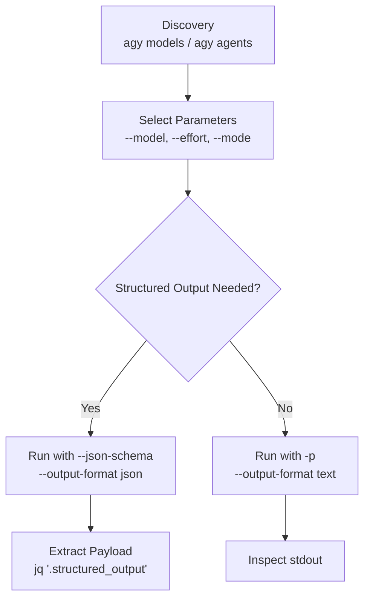

# Antigravity CLI (`agy`) Execution & Automation

Direct CLI invocation reference to execute prompts non-interactively, route tasks to specific AI models and subagents, enforce structured JSON schemas, and manage MCP servers and plugins via `agy`.

---

## ⛔ CRITICAL RULE: NO INTERACTIVE TUI

**NEVER run `agy` without `-p` / `--print` or a non-interactive subcommand.**
Bare `agy` launches an interactive Terminal User Interface (TUI) that hangs headless automation waiting for terminal input.

- ❌ `agy` (PROHIBITED: Launches interactive TUI)
- ✅ `agy -p "prompt"` (Headless single-shot execution)
- ✅ `agy models` (Non-interactive discovery)
- ✅ `agy mcp list` (Non-interactive discovery)

---

## Execution Pipeline



---

## 1. Pre-Execution & Discovery

Run discovery subcommands to inspect valid identifiers before executing prompts:

```bash
# List available model aliases (e.g., gemini-3.7-flash-high, gemini-3.5-flash-low)
agy models

# List available custom subagents
agy agents

# List configured MCP servers
agy mcp list

# List installed plugins
agy plugin list
```

For the complete catalog of flags and environment variables, read [references/flags.md](references/flags.md).

---

## 2. Headless Prompt Execution

Execute prompts non-interactively using target models, reasoning effort levels, and permission bypasses:

```bash
# Basic single-shot execution
agy --model "<model-alias>" --effort <low|medium|high> -p "<prompt>"

# Unattended automation (CI/CD, scripts, tool-enabled pipelines)
agy --model "<model-alias>" \
    --effort <low|medium|high> \
    --dangerously-skip-permissions \
    --mode accept-edits \
    -p "<prompt>"
```

### Key Execution Flags

| Flag | Purpose | Recommended Use |
|---|---|---|
| `-p`, `--print` | Run non-interactively and print response to stdout. | **Mandatory** for all automated executions. |
| `--model <alias>` | Target model (e.g. `gemini-3.7-flash-high`, `gemini-3.5-flash-low`, `claude-sonnet-4-6`). | Always specify explicitly to avoid default drift. |
| `--effort <level>` | Reasoning/thinking effort: `low`, `medium`, `high`. | Use `low` for grepping/parsing; `high` for complex architecture. |
| `--dangerously-skip-permissions` | Auto-approves all tool permission prompts. | Required when tools/commands are executed unattended. |
| `--mode accept-edits` | Automatically applies file modifications without approval pauses. | Required for unattended code refactors and edits. |
| `--add-dir <path>` | Mounts an additional workspace directory into context. | Repeatable for multi-repo or multi-folder contexts. |
| `--disable-slash-commands` | Disables slash command and skill expansion in prompt text. | Recommended when prompts contain raw code with slashes. |

---

## 3. Structured JSON Schema Output

`agy` has native JSON schema enforcement. When passed `--json-schema` and `--output-format json`, `agy` returns a structured envelope where `.structured_output` strictly conforms to the requested schema.

### Syntax
```bash
agy --output-format json \
    --json-schema '<json-schema-or-file-path>' \
    -p "<prompt>"
```

### Example: Extract Structured Error Report
```bash
agy --model "gemini-3.5-flash-low" --effort low \
    --output-format json \
    --json-schema '{"type":"object","properties":{"error_count":{"type":"integer"},"errors":{"type":"array","items":{"type":"string"}}},"required":["error_count","errors"]}' \
    -p "Extract all critical errors from the following log: $(tail -n 100 /var/log/syslog)" \
    | jq '.structured_output'
```

### JSON Output Envelope Schema
```json
{
  "conversation_id": "UUID string",
  "status": "SUCCESS | ERROR",
  "response": "Text response string",
  "structured_output": { /* conforms to requested schema */ },
  "duration_seconds": 2.45,
  "num_turns": 1,
  "usage": {
    "input_tokens": 12000,
    "output_tokens": 85,
    "thinking_tokens": 40,
    "cache_read_tokens": 0,
    "total_tokens": 12085
  }
}
```

---

## 4. Subagent Routing & Session Resumption

### Routing to a Specific Custom Agent
```bash
agy --agent <agent-name> --dangerously-skip-permissions -p "<prompt>"
```

### Resuming Previous Sessions
```bash
# Continue the most recent conversation
agy -c -p "<follow-up prompt>"

# Resume a specific conversation ID
agy --conversation "<UUID>" -p "<follow-up prompt>"
```

---

## 5. Ecosystem Administration (MCP & Plugins)

### Model Context Protocol (`agy mcp`)
```bash
# List configured MCP servers
agy mcp list

# Add stdio server
agy mcp add <name> <command> [args...]

# Add stdio server with environment variables
agy mcp add --env GITHUB_TOKEN=xxx gh npx -y @modelcontextprotocol/server-github

# Add HTTP server with headers
agy mcp add --header "Authorization: Bearer <token>" context7 https://mcp.context7.com/mcp

# Enable / Disable server
agy mcp enable <name>
agy mcp disable <name>

# ⚠ WRITE: Permanently remove server configuration
agy mcp remove <name>
```

For advanced containerized configurations and auth details, read [references/mcp-and-plugins.md](references/mcp-and-plugins.md).

### Plugin Management (`agy plugin`)
```bash
# List installed plugins
agy plugin list

# Validate plugin definition before installing
agy plugin validate /path/to/plugin-dir

# Install plugin
agy plugin install /path/to/plugin-dir

# Enable / Disable plugin
agy plugin enable <name>
agy plugin disable <name>

# ⚠ WRITE: Uninstall plugin
agy plugin uninstall <name>
```

---

## 6. Multi-Turn Streaming Protocol

For real-time event processing and multi-turn piping over standard I/O:
```bash
agy --input-format stream-json --output-format stream-json --dangerously-skip-permissions
```
Read [references/stream-json.md](references/stream-json.md) for NDJSON message schemas and Python/Node integration examples.

---

## What NOT to Do

- **MUST NOT invoke bare `agy`**; use `agy -p "<prompt>"` or dedicated subcommands instead to prevent terminal freezes.
- **MUST NOT guess model aliases**; run `agy models` first to verify valid model identifiers.
- **MUST NOT remove MCP servers or uninstall plugins without explicit user confirmation**; these are destructive mutations marked `⚠ WRITE`.
- **MUST NOT omit `--dangerously-skip-permissions` in unattended tool workflows**; tool execution will halt waiting for interactive confirmation prompts.

---

## Exit Criteria & Verification

- Direct commands exit with code `0` on success.
- With `--output-format json`, verify `.status == "SUCCESS"`.
- If a command fails, inspect stderr or run `agy --output-format text -p "<prompt>"` to diagnose the underlying provider or tool error.
